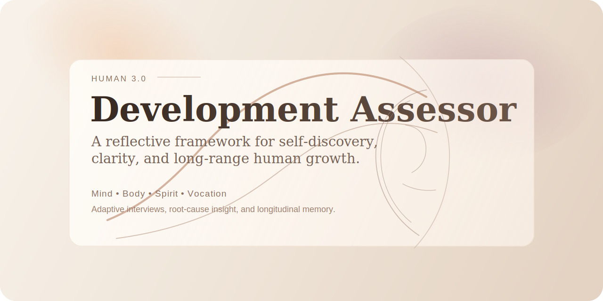

<p align="center">
  
</p>

<p align="center">
  <a href="./README.zh-CN.md" target="_blank"><strong>中文说明</strong></a>
</p>

# HUMAN 3.0 Development Assessor

> A direct, adaptive assessment and coaching framework for mapping human development across Mind, Body, Spirit, and Vocation, then turning insight into action.

[](https://github.com/chengjialu8888/Human-3.0)
[](./SKILL.md)
[](./README.md)
[](./README.md)
[](./README.zh-CN.md)

## In One Sentence

HUMAN 3.0 is for people who do not just want comfort, productivity hacks, or personality labels. It gives them a structural map of what is actually driving their growth, stagnation, and self-deception.

## Origin

This project is inspired by Dan Koe's HUMAN 3.0 prompt and framework:

- Source: [Prompt: HUMAN 3.0 Self-Discovery & Metatype Test](https://letters.thedankoe.com/p/prompt-human-30-self-discovery-and)

## Why It Hooks Attention

- It combines assessment and coaching instead of stopping at diagnosis.
- It treats AI as a developmental force, not just a utility.
- It is built for longitudinal use with cross-session memory.
- It is willing to identify false transformation, not just repeat nice-sounding insights.

## Why It's Worth Using

The original HUMAN 3.0 pitch lands because it promises something most self-help tools do not:

- It does not put you in a personality box. It tries to map your actual development across Mind, Body, Spirit, and Vocation.
- It helps expose false growth. You may look evolved in one area while quietly collapsing in another.
- It looks for the one hidden bottleneck creating pain everywhere else, instead of letting you waste energy solving symptoms.
- It gives a concrete transformation path, not vague reflection: what to do in the next 30, 90, and 180 days.
- It makes AI part of the diagnosis. Not just as a productivity aid, but as a force that can either accelerate development or weaken your mind through outsourcing.
- It is built to give you something useful immediately, not after months of abstract introspection.

## What This Project Does

This repository contains a HUMAN 3.0 skill and framework that can:

- run an adaptive HUMAN 3.0 interview
- switch between first-assessment mode and ongoing-coach mode
- assess development across Mind, Body, Spirit, and Vocation
- identify likely levels, phases, Metatype, and Lifestyle Archetype
- detect false transformation, regression, and Glitch risk
- trace specific life problems back to cross-quadrant structural causes
- produce a direct assessment report in chat
- ask whether the report should be exported to a Feishu document
- persist cross-session memory for follow-up consultations
- adapt to different agent runtimes such as Codex, Claude Code, and other personal AI agents

## Compatibility

This project is agent-compatible, not Codex-only.

It works best when an agent can:

- follow a long-form system or skill prompt
- ask one question at a time
- maintain session context
- optionally store memory between sessions
- optionally export or save reports

That makes the framework a strong fit for:

- Codex skills
- Claude Code workflows
- custom personal agents
- memory-enabled chat agents
- local or hosted coaching assistants

## Typical Use Cases

People usually come to this project in one of these states:

- `I want a real developmental assessment, not another personality quiz.`
- `I keep having the same life problem in different forms.`
- `I use AI heavily and want to know whether it's helping me grow or making me weaker.`
- `I want a coaching system that remembers what I said last time.`

## What Makes It Different

### 1. It does not chase balance for its own sake

This skill assumes the real bottleneck in one quadrant is often caused by neglect in another. It looks for the root problem that creates the biggest downstream effect.

### 2. It is designed to tell the truth, not flatter the user

The output is meant to be respectful, but not soft. If someone is using advanced language to hide weak embodiment, the assessment should catch it.

### 3. It supports longitudinal development

The first session creates a baseline. Later sessions retrieve that baseline, compare it to current behavior, and update the user's developmental trajectory.

### 4. It treats AI as a serious developmental variable

Most self-improvement tools treat AI as neutral or obviously beneficial. This project treats AI as a meta-Glitch: powerful, useful, and potentially destabilizing if used without foundation.

### 5. It gives you a next core problem, not just a description

The most compelling idea in the original HUMAN 3.0 framing is that most people are solving the wrong problem. This skill is built to surface the next core problem that would create the biggest positive cascade if solved.

## What You Actually Get

Instead of vague reflection, the user gets:

- a four-quadrant diagnosis
- a likely Metatype and Lifestyle Archetype
- a named root problem
- a concrete 30/90/180-day strategy
- a warning about likely regression and self-sabotage
- a continuity layer for future sessions

## Who It Is For

This project is especially useful for:

- coaches and facilitators building structured assessment flows
- people exploring developmental models beyond surface productivity
- AI-native users who want a sharper framework for growth and dependency risk
- creators building long-term advisory or reflection systems

## Quick Start

### 1. Clone the repository

```bash
git clone https://github.com/chengjialu8888/Human-3.0.git
cd Human-3.0
```

### 2. Review the core files

- [SKILL.md](./SKILL.md): the operating instructions for the assessment skill
- [references/human-3-model.md](./references/human-3-model.md): the HUMAN 3.0 model knowledge base
- [references/assessment-template.md](./references/assessment-template.md): the output contract
- [references/session-memory.md](./references/session-memory.md): the cross-session memory workflow
- [references/coaching-patterns.md](./references/coaching-patterns.md): the live-problem coaching layer

### 3. Use it in Codex

Example prompts:

- `Use $human-3-development-assessor to run a first HUMAN 3.0 assessment.`
- `Use $human-3-development-assessor to continue my follow-up consultation and retrieve prior memory first.`

### 4. Use it in Claude Code

Recommended setup:

- `SKILL.md` as the primary behavior prompt
- `references/human-3-model.md` as the theory layer
- `references/assessment-template.md` as the output contract
- `references/session-memory.md` as the continuity layer
- `references/coaching-patterns.md` as the live-problem coaching layer

### 5. Use it in Other Personal Agents

If you are building your own agent stack:

1. treat [SKILL.md](./SKILL.md) as the orchestration prompt
2. load the `references/` files on demand
3. map the memory workflow to your own storage layer
4. map Feishu export to your own document or note-taking tool if Feishu is unavailable

The framework is portable. The tool layer is replaceable.

## Example Experience

What makes this project feel different is not just the framework. It is the interaction pattern:

1. it asks one question at a time
2. it notices contradictions
3. it traces surface pain to structural causes
4. it gives a direct report in chat
5. it remembers what happened next time

Example shift:

- Surface problem: `I can't stick to my habits.`
- Structural reading: `Your Body failure is being driven by Spirit depletion and a Mind-level knowing-doing split.`
- Next action: `Rebuild one tiny physical practice that survives emotional chaos before touching bigger optimization goals.`

## Repository Structure

```text
.
├── SKILL.md
├── README.md
├── README.zh-CN.md
├── agents/
│   └── openai.yaml
├── assets/
│   └── github-header.svg
├── memory/
│   └── .gitkeep
└── references/
    ├── assessment-template.md
    ├── coaching-patterns.md
    ├── human-3-model.md
    └── session-memory.md
```

## Runtime Behavior by Environment

Different agents will support different parts of the workflow:

- In Codex: native skill structure and local file references work well.
- In Claude Code: prompt orchestration and local project references work well.
- In custom agents: memory and export behavior depend on your own toolchain.
- In plain chat interfaces: the assessment still works, but persistent memory and exports may need manual handling.

## Why Readers May Care

This project is interesting not only as a self-development artifact, but also as:

- a design pattern for AI coaching systems
- a memory-aware advisory workflow
- a case study in turning abstract philosophy into operational prompts

## Suggested GitHub Description

`A HUMAN 3.0 assessment and coaching framework for Codex, Claude Code, and personal AI agents: adaptive four-quadrant interviews, root-cause analysis, and cross-session memory for longitudinal growth.`

## Contributing

Good future improvements could include:

- richer examples of assessment sessions
- Feishu export automation when tools are available
- stronger privacy controls for persistent memory
- agent-specific setup presets

## Final Note

This is not a feel-good self-help wrapper. It is a structured attempt to make human development legible, actionable, and harder to fake.
